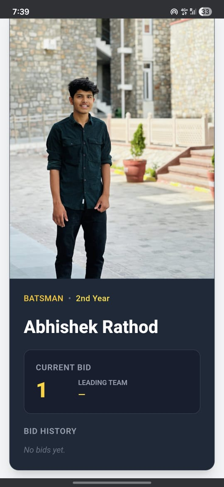
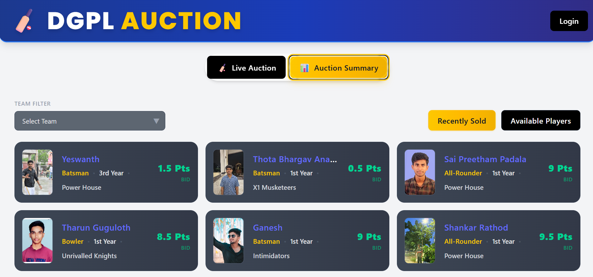
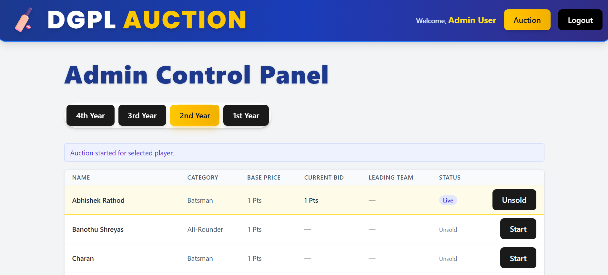
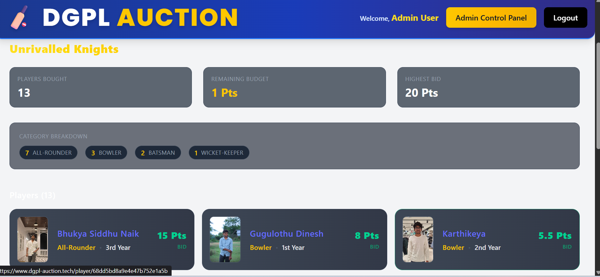

# DGPL Auction - Real-Time Player Auction Platform

🔗 **[Live Demo](https://www.dgplauction.online)**

## Introduction

DGPL Auction is a full-stack, real-time web application designed to digitize and streamline the player auction process for the Dussehra Gulteez Premier League (DGPL), a cricket tournament organized by the Telugu student community at MNIT Jaipur. This project replaces the traditional manual auction with a secure, engaging, and interactive online platform, enabling seamless management and participation for admins, team captains, and viewers.

Built to solve a real-world problem, this application transforms the auction experience from a chaotic offline process into a smooth, transparent, and exciting digital event that brings the community together.

---

## 📸 Screenshots / Demo

### Live Auction View

  
_Real-time bidding interface with live updates_

### Auction Summary Dashboard

  
_Comprehensive dashboard showing recent bids and unsold pool_

### Admin Panel

  
_Powerful admin controls for managing the auction flow_

### Team Roster

  
_Team Roster showing breakdown and each player in it_

---

## ✨ Key Features

- **🔴 Real-Time Bidding**  
  Live updates for all users using Socket.IO, ensuring everyone sees the latest bids instantly.

- **👥 Role-Based Access Control**  
  Distinct roles for Admin, Team Captain, and Public Viewer, each with tailored permissions and UI.

- **🔐 Secure JWT Authentication**  
  Robust login and session management using JSON Web Tokens with bcrypt password hashing.

- **⚙️ Admin Control Panel**  
  Comprehensive tools for managing auction flow, including player selection by year, selling, and marking unsold.

- **📊 Live Auction Summary Dashboard**  
  Real-time team statistics, player rosters, recent bids, and comprehensive auction analytics.

- **👤 Detailed Player Profiles**  
  Individual pages with player stats, images, bid history, and team assignments.

- **📱 Mobile-First, Responsive Design**  
  Optimized for all devices using Tailwind CSS with dark theme support.

- **🏏 Team Management & Budget Tracking**  
  Complete team roster management with captain assignments and dynamic budget deduction logic.

- **⚡ Race-Condition Prevention**  
  Atomic MongoDB `$expr` queries prevent double-bids and budget overspends.

---

## 🔑 Demo Credentials

### Admin Account
| Role | Email | Password | Access |
| :--- | :--- | :--- | :--- |
| **Admin** | `admin@dgplauction.com` | `AdminPass123!` | Full Admin Control Panel (`/#/admin`) |

### Team Captain Accounts
*(Use these to place live real-time bids during active player auctions)*

| Team | Email | Password |
| :--- | :--- | :--- |
| **Unrivalled Knights** | `captain.unrivalledknights@dgplauction.com` | `CaptainPassUK` |
| **X1 Musketeers** | `captain.x1musketeers@dgplauction.com` | `CaptainPassXM` |
| **Power House** | `captain.powerhouse@dgplauction.com` | `CaptainPassPH` |
| **Intimidators** | `captain.intimidators@dgplauction.com` | `CaptainPassI4` |

---

## 🛠️ Tech Stack

### Frontend

- **[React 19](https://react.dev/)** (Vite) - Modern React development with fast HMR
- **[Tailwind CSS v4](https://tailwindcss.com/)** - Utility-first CSS framework
- **[React Router](https://reactrouter.com/)** - Client-side routing (`HashRouter` for GitHub Pages compatibility)
- **Context API** - Global state for authentication (`AuthContext`) and real-time sockets (`SocketContext`)
- **[Socket.IO Client](https://socket.io/)** - Real-time bidirectional communication

### Backend

- **[Node.js](https://nodejs.org/)** - JavaScript runtime environment
- **[Express.js](https://expressjs.com/)** - Fast, minimalist web framework
- **[Mongoose](https://mongoosejs.com/)** - MongoDB object modeling for Node.js
- **[Socket.IO](https://socket.io/)** - Real-time engine for live updates
- **[JWT](https://jwt.io/)** - JSON Web Token authentication
- **[bcryptjs](https://github.com/dcodeIO/bcrypt.js)** - Password hashing library

### Database

- **[MongoDB Atlas](https://www.mongodb.com/atlas)** - Cloud database service

### Deployment & Infrastructure

- **[GitHub Pages](https://pages.github.com/)** - Frontend hosting with Custom Domain (`www.dgplauction.online`)
- **[Render](https://render.com/)** - Backend server hosting (`https://dgpl-auction.onrender.com`)
- **[GitHub Actions](https://github.com/features/actions)** - Automated CI/CD pipeline

---

## 🚀 Local Development Setup

### Prerequisites

- Node.js (v18+ recommended)
- npm
- MongoDB Atlas account (or local MongoDB installation)

### 1. Clone the Repository

```bash
git clone https://github.com/manojdharavath/DGPL-Auction.git
cd DGPL-Auction
```

### 2. Backend Setup

```bash
# Navigate to backend directory
cd backend

# Install dependencies
npm install

# Create environment configuration file
cp config.env.example config.env
# Edit config.env with your MongoDB URI and secrets

# Seed the database with initial players, teams, and users
node seed.js --delete && node seed.js --import

# Start backend development server
npm run dev
```

The backend server will run on `http://localhost:7777`

### 3. Frontend Setup

```bash
# In a new terminal, navigate to frontend directory
cd frontend

# Install dependencies
npm install

# Create environment file for development
cp .env.development.example .env.development
# Edit .env.development with your API URL

# Start frontend development server
npm run dev
```

The frontend will be available at `http://localhost:5173`

---

## 🔧 Environment Variables

### Backend Configuration (`backend/config.env`)

```env
# Server Configuration
PORT=7777
NODE_ENV=development

# Database
DATABASE=mongodb+srv://<username>:<password>@cluster0.mongodb.net/dgplauction?retryWrites=true&w=majority
DATABASE_PASSWORD=<your_db_password>

# JWT Configuration
JWT_SECRET=your-super-secret-jwt-key
JWT_EXPIRES_IN=7d

# CORS Origins (comma-separated)
CORS_ORIGIN=http://localhost:5173,https://www.dgplauction.online,https://dgplauction.online
```

### Frontend Configuration (`frontend/.env.development`)

```env
VITE_API_URL=http://localhost:7777
VITE_SOCKET_URL=http://localhost:7777
```

---

## 📁 Project Structure

```
DGPL-Auction/
├── backend/
│   ├── controllers/        # Express route logic & atomic auction controllers
│   ├── data/               # Initial JSON seed data (players, teams, users)
│   ├── models/             # Mongoose data schemas (User, Player, Team, AppConfig)
│   ├── routers/            # API endpoints (/players, /teams, /users, /auction)
│   ├── utils/              # API features, AppError, catchAsync helpers
│   ├── app.js              # Express app configuration & middleware
│   ├── server.js           # Server entry point & Socket.IO bid handler
│   └── seed.js             # Database migration and seeding script
├── frontend/
│   ├── public/             # Static assets & CNAME record
│   ├── src/
│   │   ├── components/     # CurrentPlayer, SoldBanner, AuctionSummary UI components
│   │   ├── context/        # AuthContext and SocketContext providers
│   │   ├── pages/          # AdminPage, LoginPage, PlayerProfilePage
│   │   ├── config.js       # Dynamic API URL fallback config
│   │   └── App.jsx         # App router and live socket listeners
│   └── vite.config.js      # Vite build configuration
├── .github/
│   └── workflows/          # GitHub Actions deploy workflow
├── screenshots/            # UI screenshots & showcase images
└── README.md
```

---

## 🤝 Contributing

1. Fork the repository
2. Create your feature branch (`git checkout -b feature/AmazingFeature`)
3. Commit your changes (`git commit -m 'Add some AmazingFeature'`)
4. Push to the branch (`git push origin feature/AmazingFeature`)
5. Open a Pull Request

---

## 📄 License

This project is for educational and community use under the ISC License.

---

## 🙏 Acknowledgements

- **DGPL Organizers** - For providing the real-world problem that inspired this solution
- **MNIT Jaipur Telugu Student Community** - For their support and feedback
- **Open Source Community** - For the amazing tools and libraries that made this possible

---

## 📞 Contact

**Project Maintainer:** [manojdharavath](https://github.com/manojdharavath)

For questions, suggestions, or contributions:
- 📧 Open an issue on GitHub
- 💬 Reach out via GitHub discussions

---

## 🔗 Links

- **[Live Application](https://www.dgplauction.online)**
- **[Backend API Server](https://dgpl-auction.onrender.com)**
- **[GitHub Repository](https://github.com/manojdharavath/DGPL-Auction)**

---

_Built with ❤️ for the DGPL community_
